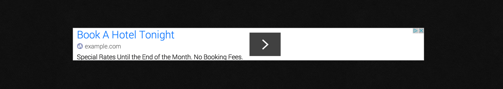

# [][project]

## This plugin introduces adsense to add ads in you page modulars.

#### Table of Contents:

-   [About](#about)
-   [Installation and Updates](#installation-and-updates)
-   [Usage](#usage)
-   [Contributing](#contributing)
-   [Licencse](#license)

## About

`AdSense` is a plugin for [**Grav**](http://getgrav.org) that let you add adsense to some place in you modular. _adsense_ can be displayed as banner in relativ or fixed mode.



## Installation and Updates

Installing or updating the `adsense` plugin can be done in one of two ways. Using the GPM (Grav Package Manager) installation update method (i.e. `bin/gpm install adsense`) or manual install by downloading [this plugin](https://github.com/muuvmuuv/grav-plugin-adsense) and extracting all plugin files to

    user/plugins/adsense

## Usage

The `adsense` plugin comes with some sensible default configuration, that are pretty self explanatory:

### Config Defaults

```yaml
# Global plugin configurations

enabled: true             # Set to false to disable this plugin completely
sandbox: false            # Enables a demo mode for local purpose

# Default configurations for AdSense

adsense:
  options:
    type: "banner"        # Assets type (either "banner" or "fixed")
    direction: "top"      # Assets direction (either "left", "right", "top", "bottom")
    priority: -999        # Priority to add CSS or JS to Grav pipeline, bigger comes first
    pipeline: false       # Pipeline assets or not
    load: ""              # Load asset either asynchronously "async", deferred "defer" or normal ""
    resource: "https://pagead2.googlesyndication.com/pagead/js/adsbygoogle.js" # AdSense script url

  data:
    client: "ca-pub-1147018993230160"     # AdSense client
    slot: 1160605533                      # AdSense slot
```

If you need to change any value, then the best process is to copy the [adsense.yaml](adsense.yaml) file into your `users/config/plugins/` folder (create it if it doesn't exist), and then modify there. This will override the default settings. Is the admin plugin installed on you GRAV site, you can easily configure this options in the plugin section. Just click on the plugin name and scroll a bit down.

For displaying the ad in a modular, you need to a shortcode into your content. You also have the abbility to change some options for modular only or the shortcode itself.

```yaml
adsense:
  active: true
  type: "banner"
  direction: "left"
  slot: '1160605533'
```

```md
[adsense type="" direction="" sandy="" class=""][/adsense]
```

> The `active: true` enables the _AdSense Plugin_ just for this module.

## Contributing

You can contribute at any time but before opening any issue, please search for existing issues.

After that please note:

-   If you find a bug, would like to make a feature request or suggest an improvement, [please open a new issue][issues]. If you have any interesting ideas for additions to the syntax please do suggest them as well!
-   Feature requests are more likely to get attention if you include a clearly described use case.
-   Add images/links/etc so I can help you faster

Thanks!

## License

Copyright (c) 2015 [Marvin Heilemann][github].

For use under the terms of the [MIT][mit-license] license.

[github]: https://github.com/muuvmuuv/ "GitHub account from Marvin Heilemann"

[mit-license]: http://www.opensource.org/licenses/mit-license.php "MIT license"

[project]: https://github.com/muuvmuuv/grav-plugin-adsense

[issues]: https://github.com/muuvmuuv/grav-plugin-adsense/issues "GitHub Issues for Grav adsense Plugin"
